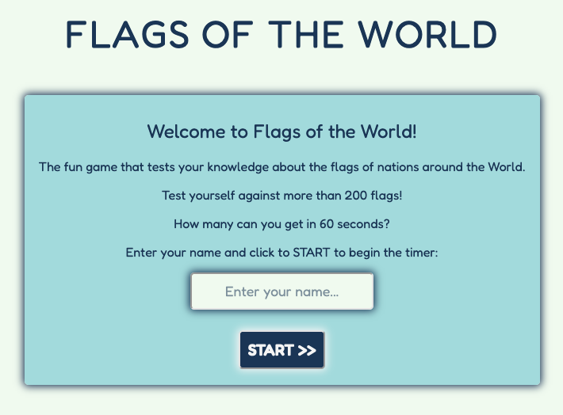
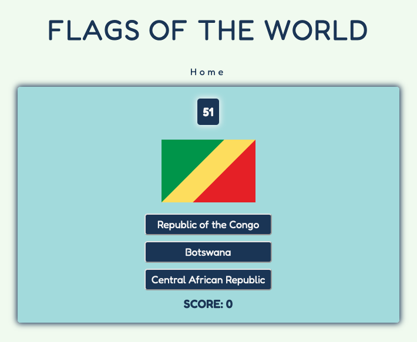
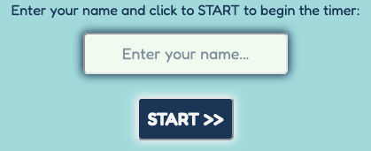
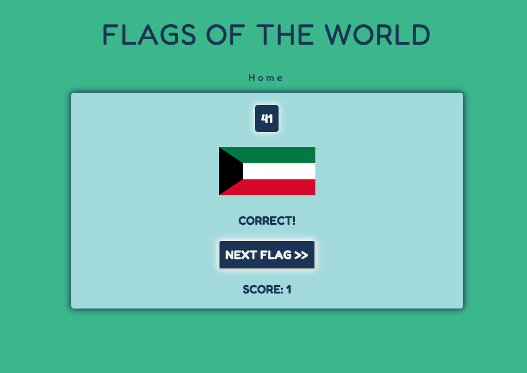
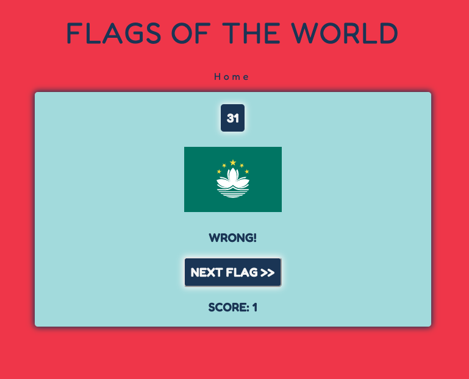
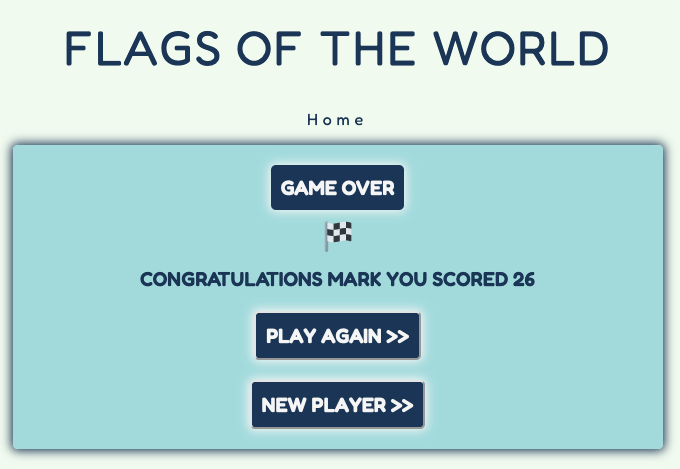

# FLAGS OF THE WORLD

## By Mark Todman
---

The deployed [Flags of the World website.](https://marktodman.github.io/flags-of-the-world/)

The [GitHub repository.](https://github.com/marktodman/flags-of-the-world)

---
## OVERVIEW
---

1. [User Experience](#user-experience-ux)
2. [Testing](#testing)
3. [Deployment](#deployment)
4. [Future Development Ideas](#future-development-ideas)
5. [Credits](#credits)

---
## USER EXPERIENCE (UX)
---

## Strategy

Flags of the World is a fun game for users to test their knowledge against the clock about flags of the nations around the World. The site is simple and straightforward, fully focused on generating positive user engagement in repeatedly playing the game to increase their knowledge and beat their previous score. The game is desgined to challenge the user to set and beat their score, creating a new random set of flags for each 60 second game (from 216 flags). 

### Target Audience:

- People who want to learn more about flags of nations around the World
- Users who want an engaging and challenging game
- Users who want to challenge and compare their knowlege about flags of the World with their friends.

## Scope

Flags of the World is a single-purpose site, fully focused on the user experience of trying to identify as many flags of nations around the World as possible in 60 seconds.

Ease-of-use is defined by mobile-first, responsive design, with limited navigation and site content fully focused on the game experience.

The site includes the ability to input Player Name to deliver a personalised experience with the score returned at the end of the game. The game is easy to use and to restart after each 60 second countdown, encouraging the user to try and beat their previous score. There is also the option to change the player so that different players can swap between each set of 60 seconds.

## Structure

Flags of the World based on a mobile-first single page with three clear stages of the game:

1. LANDING PAGE: the landing page contains the instructions, player name input and the start button.

2. GAME PLAY: the game play section displays the countdown timer, the flag image, three answer buttons and the score.
- After each button click the player receives feedback (Correct! or Wrong!), the score increments (for a correct answer), and there is a 'next' button to move to the next flag and set of answers

3. GAME OVER: the game ends when the timer reaches zero. At the end of the game the named player is told their score and encouraged to either 'play again' or pass to a 'new player'.
- Play again restarts the GAME PLAY section. 
- New Player returns to the LANDING PAGE to enter a new player name and start the game again.

## Features

The site is designed to focus user attention and quickly and easily enter into the game play, which is why the site is on one mobile-friendly page. 

The game is all on one page, within one game area container. Using one game area container facilitates site design that focuses user attention on the game area, whether on small (mobile) or large (desktop) screens. Styling, including colors and shadow have been used to make the game container standout on the page:

The landing page contains clear instructions to the user that they have 60 seconds to guess as many flags as possible. They are led to input their name through the design of the input box, which has shadow to make it stand out and placeholder information ('Enter your name...'). It is the clear to the user that they should click start, both through written instructions and the intuitive START>> button.

Once the START>> button is pressed the GAME PLAY layout loads in the game container. The GAME PLAY layout includes:
- the countdown timer which starts at 60 seconds and counts down to zero
- a randomly generated flag image which are all fixed width at 160px. There are 216 randomly generated flag images
- three answer buttons which are generated from answers associated with each flag image
- the score element which increases once a correct answer have been selected.

In addition to the changes in the GAME PLAY layout, Home navigation also becomes available as this allows the user to return to the first screen at any time during the game. This is critical to the user experience, as the alternative is to wait for the full timer to run down to restart for any reason. In addtion, the logo is also an active link which will return the user to the index.html page. Both of these elements have a hover function to make it clear to the user that they are active.

During GAME PLAY there is live user feedback on whether their chosen answer is CORRECT or WRONG:
- If the chosen answer is CORRECT, the user will receive a message stating CORRECT!, the body of the page will become a green color and their score will increase by 1 and a NEXT FLAG>> button will appear so that they can advance the game.
- If the chosen answer is WRONG, the user will receive a massage stating WRONG!, the body of the page will become a red color and a NEXT FLAG>> button will appear so that they can advance the game. There is no change in the score for a wrong answer.

Once the timer has run to zero, the user is automatically moved to the GAME OVER layout. The GAME OVER layout includes the following features:
- the timer displays GAME OVER
- there is a checkered flag as a visual indication of the end of the game
- there is a statement congratulating the player by name and providing them with their score
- there are two options: 1) either to PLAY AGAIN>> as the same named player or 2) to play as a NEW PLAYER>>

If the user clicks PLAY AGAIN>> they are taken straight back into the GAME PLAY layout and the timer starts to countdown automatically. They will be presented with a new set of flags. Once the 60 second timer is complete the user will be taken to the GAME OVER page where their name and their new score will be presented.

If the user clicks NEW PLAYER>> they are taken to the index.html page, which allows a new player name to be input and the game to be started again. Once the 60 second timer is complete the new user will be taken to the GAME OVER page where their name and their score will be presented.

The game is designed to keep the user playing, either on their own to beat their previous score, or with a friend on the same device.

## Visual Design

The game is designed to work on screens down to around 250px which should mean that the site is fully responsive. 

The visual design was chosen specifically to make the game play area stand out and to focus the user on the center of the screen. Effects such as shadow and button hover are utilised to provide emphasis and user feedback.

The website is designed to be clean and clear for the user. The color palette was chosen as the colors are complimentary to many of the flags of the World, whilst also enabling contrast between elements [Coolors](https://coolors.co/). These colors were used throughout with darker colors for the text and lighter colors for the backgrounds. This design was inverted for the buttons to make them stand out with light text on a dark background/ 

One additional green color was chosen to be displayed in the body as an indication of a correct answer.

Fredoka was chosen at the font for use throughout the site as it is an easy to read, sans serif font that also provides enough interest to enhance the UI whilst playing the game. 

--- 
## TESTING
---

## User Stories

Testing of user stories was conducted throughout the build. Detailed User Stories can be [read here](userstories.md)

## HTML Validation

The HTML code has been tested for errors with the [W3 HTML Validator](https://validator.w3.org/nu/?doc=https%3A%2F%2Fmarktodman.github.io%2Fflags-of-the-world%2F) and passed with no errors.

## CSS Validation

The CSS code has been tested for errors with the [W3 CSS Validator](https://jigsaw.w3.org/css-validator/validator?uri=https%3A%2F%2Fmarktodman.github.io%2Fflags-of-the-world%2F&profile=css3svg&usermedium=all&warning=1&vextwarning=&lang=en) and passed with no errors.

## JavaScript Validation

The JavaScript code has been tested for errors with [JSHint](https://jshint.com/) and passed with no errors.

## Accessibility 

The website has been tested for accessbility using Lighthouse on Chrome DevTools and scored 100.

## Fixes

There were a number of fixes identified during validation:

1. Image source. The div element on the index.html page was empty as it is populated through the JavaScript code.
2. Border color. There was an invalid piece of code in the border color. The code was removed.
3. Label for input field. The label id and input id did not match. 
4. Extra element tag. An extra element tag was identified. The extra tag was deleted.

---
## DEPLOYMENT
---

The site has been deployed through [GitHub Pages.](https://github.com/marktodman/flags-of-the-world)

## Remote Deployment

The steps to remote deployment via GitHub Pages are:

1. Create an account at [GitHub](https://github.com/).
2. Log into your GitHub account.
3. Go to the GitHub repository for [Flags of the World](https://github.com/marktodman/flags-of-the-world).
4. Click on 'Settings'.
5. Select 'Pages' from the menu on the left-hand-side.
6. Under 'Source' select 'Main' and click 'Save'.
7. Notification that the site is published appears on the top of the pages section together with a [link to the site](https://marktodman.github.io/flags-of-the-world/).

## Local Depoloyment

The steps to make a local copy via GitHub pages are:

1. Create an account at [GitHub](https://github.com/).
2. Log into your GitHub account.
3. Go to the GitHub repository for [Flags of the World](https://github.com/marktodman/flags-of-the-world).
4. Click the green 'Code' button.
5. Select your chosen clone format: HTTPS, SSH or GitHub CLI.
6. Click the 'copy' button.
7. Deploy the copy locally.

## Forking the GitHub Repository

To use this code and make changes without affecting the original code, it is possible to 'fork' the code on the GitHub repository through the following steps:

1. Create an account at [GitHub](https://github.com/).
2. Log into your GitHub account.
3. Go to the GitHub repository for [Flags of the World](https://github.com/marktodman/flags-of-the-world).
4. Click the 'Fork' button in the upper right hand corner of the page.
5. A copy of the repository will be available in your own repository.

---
## FUTURE DEVELOPMENT IDEAS
---

There is room for further improvements in this game including:
- A high score table
- Saving of scores by player
- User functionality to adjust the timer for longer or shorter intervals

---
## CREDITS
---

All content is originaly written by the site author, Mark Todman. Additional links to external material are provide in the website.

[Scott Webb on Pexels](https://www.pexels.com/@scottwebb) provided the hero image.

Icons were sourced from [Font Awesome](https://fontawesome.com/).

[Tiny JPG](https://tinyjpg.com/) and [Compress.com](https://www.compresss.com/compress-webp.html) were utilised to compress images. [Cloud Convert](https://cloudconvert.com/jpg-to-webp) was used to convert JPG to WebP format to try and improve Performance.

The scroll to top button was created using code taken directly from [W3 Schools](https://www.w3schools.com/howto/howto_js_scroll_to_top.asp). The helpful community at [Stack Overflow](https://stackoverflow.com/questions/70734242/hidden-javascript-button-on-larger-screen) ensured that it would not display on larger screens.

[Kevin Powell](https://www.youtube.com/user/KepowOb) provided invaluable guidance on CSS Grid.

Example code and source database address from the [Code Institute](https://codeinstitute.net/) were utilised in the Newsletter sign up feature.

Chris Quinn as Mentor and John Traas in Tutor Support at the [Code Institute](https://codeinstitute.net/) provided excellent direction and helped with resources to solve CSS Grid and Flexbox challenges.

