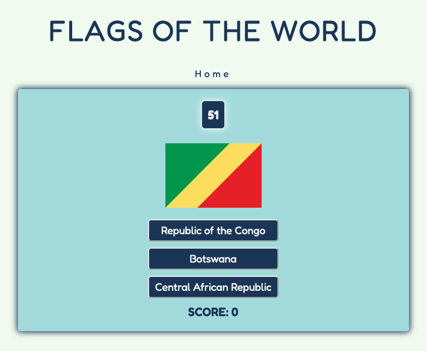
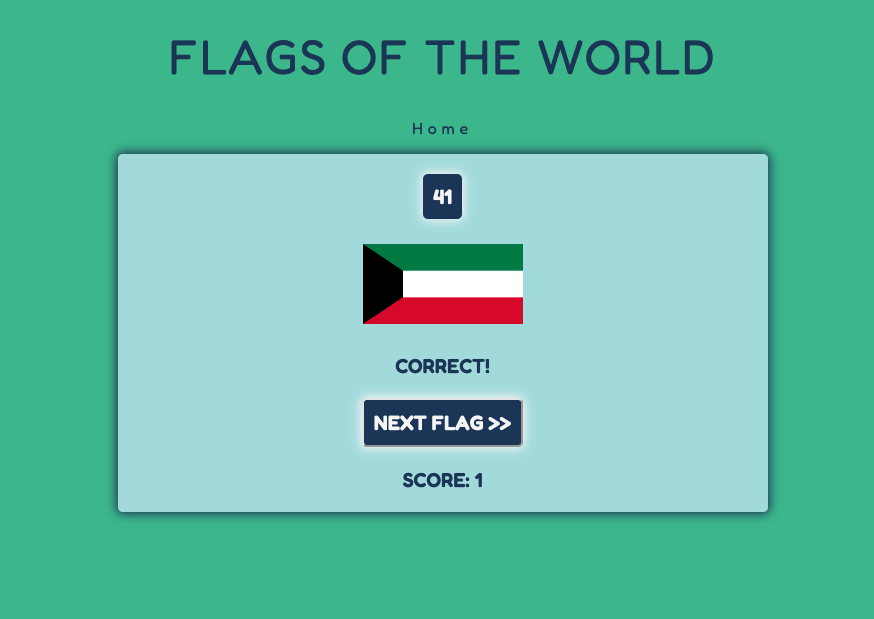
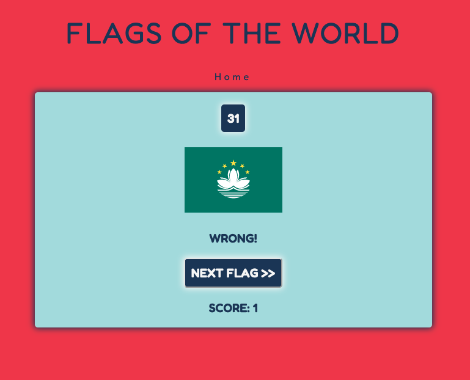
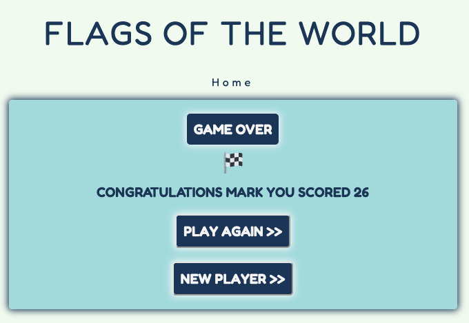

# User Story Testing

## Overview

User testing has been undertaken for:
1. [First Time User](#first-time-user)
2. [Repeat User](#repeat-user)
3. [Site Developer](#site-developer)

## First Time User
---
As a first time user the site should have:
1. Clear instructions
2. Obvious controls
3. Feedback on results
4. A score to measure progress
5. The opportunity to keep playing

### Clear Instructions

The landing page is clear and straightforward. This is a 60 second timed test to see how many flags I can guess. I should input my name and press START>>:

### Obvious Controls

The START>> button is the obvious and only way to start the game. Once in the game the answer buttons are obvious.

Once the answer is selected there is feedback and the NEXT>> button to move to the next question.

### Feedback on Results

Once the answer is selected there is a clear indication whether the answer is CORRECT or WRONG. This is achieved in the text and through background colors.

There is also a final result at the end of the countdown timer that is personalised to the player and shows the total score.

### A Score to Measure Progress

The score is clearly visible at all times and automatically updates after each correct answer.

### The Opportunity to Keep Playing

At the end of the game, there is a clear option to PLAY AGAIN>>.

## Repeat User
---
As a repeat user the site should include the following:
1. An option to restart the game 
2. The chance to share the experience with a friend
3. A way to measure of improvement

### An Option to Restart the Game

A repeat user will want to try and beat their previous score, so may wish to restart if they make too many mistakes. This can be achieved through the Home navigation which appears during game play.

### The Chance to Share the Experience with a Friend

At the end of the game there is the option to pass to a NEW PLAYER>>. This allows a new user to input their name and get personalised feedback on their final score.

Future version updates could include:
- a share button to send a link to the game to others
- a high score table that saves results with player names

### A Way to Measure Improvement

In this version, the user has to remember their highest scores. 

Future version updates could include:
- a high score table that saves results with player names

## Site Developer
---
As the site, I conducted two user interviews to gather feedback on the system to ensure the site meets the strategy:

1. Fun
2. Easy to play
3. Educational
4. An addictive feel to keep users playing 

### Question 1. What did you think about the game?

P1. I found the game good fun and engaging. It looks good too.

P2. I couldn't stop playing to start with and my score increased each time I played.

### Question 2. Did you find the game easy to play?

P1. The game is quite straightforward and easy to play.

P2. Yes, the game was pretty easy. I got quicker as I kept playing the game.

### Question 3. What did you learn from playing the game?

P1. There were some countries I didn't know and some I still don't! 

P2. I did learn some flags and I also worked out that the answers stayed the same, so I managed to increase my scores based on recognising flags and answers after a few trys.

### Question 4. How many times did you play the game?

P1. I played the game a few times. I found that I did repeat a few times as I wanted to improve my score.

P2. Maybe 20 or 30 times! I got up to 29 flags, I really want to get 30!

### Question 5. What updates would you like to see in new versions?

P1. It would be good if the next flag loaded automatically.

P2. I'd like to be able to track my score in the game. And challenge friends to beat my score.

### Question 6. Would you recommend the game to your friends?

P1. I think my kids would enjoy it.

P2. I have already shared the link with my partner so we can compete!
